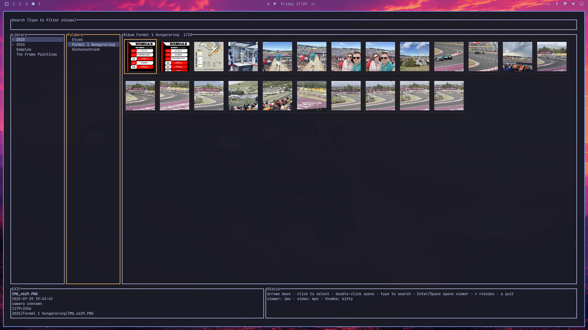
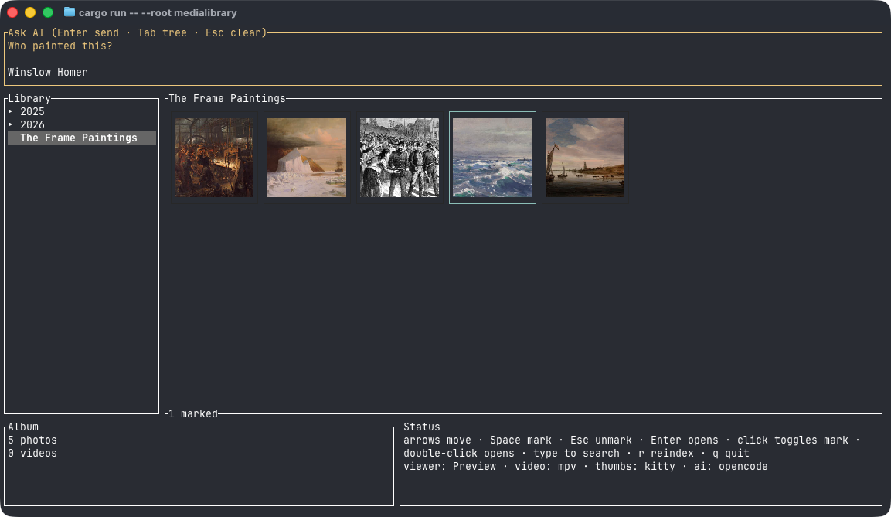

# Hallward

Terminal photo library: miller-style folders, a thumbnail grid for albums, an **external** image viewer, and **Ask AI** over marked stills. Photos stay ordinary files on disk. Hallward only adds a `.album/` directory (SQLite catalog + JPEG thumbs).



## Features

- Browse photos and videos from the Terminal
- Point Hallward on a remote or mounted file system and it works as well
- **Ask AI** questions about photos: "Which car is this?"
- View photos and videos in external viewer
- First-class [Omarchy](https://omarchy.org/) support
- More is coming. Stay tuned!

## Prerequisites

- **Ghostty**, **Kitty** or another graphic-supporting terminal. Other terminals fall back to coarse unicode blocks.
- `libheif` / `heif-convert` for HEIC thumbnails (Arch: `pacman -S libheif`)
- **ffmpeg** (ships `ffprobe`) for video **thumbnails** and Live Photo detection — not a player
- A video player: **mpv**
- (Optional) For AI use, install an agent CLI (OpenCode, Claude Code, or Codex).

**macOS:** still images open in built-in **Preview** (no extra install). Quit Preview (Cmd-Q) to return to Hallward, same as mpv. Video playback requires **mpv** (`brew install mpv`). FFmpeg’s `ffplay` is a terminal player: it tears down the TUI, dumps decoder logs to the shell, and is not an acceptable viewer. If the status pane says `video: ffplay` or `video: no player`, install mpv and restart Hallward until it shows `video: mpv`.

**Linux / Omarchy:** an image viewer: **imv** (preferred), or nsxiv, feh, swayimg. **mpv** is preferred for video; `ffplay` is a last-resort fallback only.

The status pane shows `thumbs: kitty` when the terminal is drawing real image pixels, and `thumbs: halfblocks` when it fell back to coarse unicode blocks (looks pixelated). Multiplexers must pass Kitty graphics through to the host terminal:

**tmux** (3.3+), in `~/.tmux.conf`:

```
set -g allow-passthrough on
```

Then `tmux source-file ~/.tmux.conf` (or restart tmux). Hallward already wraps Kitty sequences in tmux’s DCS envelope when it detects tmux; without `allow-passthrough`, tmux strips them.

**herdr**, in `~/.config/herdr/config.toml`:

```toml
[experimental]
kitty_graphics = true
```

Reload config (`prefix`+`shift+r`), detach, and reattach. For `herdr --remote`, set this on **both** the local client and the remote server, then restart the remote (`herdr server stop` and start again). herdr does not use tmux passthrough; this flag is the equivalent.

## Use

Point Hallward at a folder of albums (collections are folders that only contain other folders):

```text
~/Pictures/Library/
  .album/               # generated on init (catalog + thumbs)
  2025/                 # collection
    Rome/               # album (images and/or standalone videos)
  Samples/              # album
```

First run in that folder:

```bash
cd ~/Pictures/Library
hallward
```

You will be asked to initialize. That creates `.album/` and builds thumbs (HEIC decode can take a minute).

```bash
hallward init          # create .album/ and index
hallward index         # refresh after adding/removing files
hallward               # open the TUI
hallward --root PATH   # library is PATH instead of cwd
```

### Ask AI

Mark with `Space` key one or more **images** and the search bar becomes **Ask AI**. On Omarchy set a default agent. On Mac install any of these agent CLIs: opencode, pi, omp, hermes, codex, claude.



## Install

### Homebrew (macOS Apple Silicon, Linux x86_64)

```bash
brew install mauricewipf/hallward/hallward
```

Homebrew auto-taps on first install. You may need to trust the formula once:

```bash
brew trust --formula mauricewipf/hallward/hallward
```

This installs **hallward** plus `libheif`, `ffmpeg`, and `mpv`. On macOS, stills open in **Preview** (built in). On Linux, install a stills viewer separately (imv, nsxiv, feh, or swayimg). Sharp thumbnails still need Ghostty or Kitty (`brew install --cask ghostty`).

Tap: [mauricewipf/homebrew-hallward](https://github.com/mauricewipf/homebrew-hallward).

### GitHub Releases

Download a binary from [Releases](https://github.com/mauricewipf/hallward/releases):

- macOS Apple Silicon: `hallward-aarch64-apple-darwin.tar.gz`
- Linux x86_64 (glibc, Ubuntu 24.04): `hallward-x86_64-unknown-linux-gnu.tar.gz`

```bash
tar -xzf hallward-aarch64-apple-darwin.tar.gz
chmod +x hallward
# move onto PATH, e.g. mkdir -p ~/.local/bin && mv hallward ~/.local/bin/
```

The macOS binary is unsigned; if Gatekeeper blocks it, allow it in System Settings → Privacy & Security. HEIC thumbnails still need `libheif` / `heif-convert`; video thumbnails need `ffmpeg`; video **playback** needs **mpv** (`brew install mpv`). Do not use `ffplay` (see [Prerequisites](#prerequisites)).

### From source

Needs [Rust](https://rustup.rs/):

```bash
git clone https://github.com/mauricewipf/hallward.git
cd hallward
cargo install --path .
```

Or without installing:

```bash
cargo build --release
# binary: target/release/hallward
```

## Keyboard

| Key                                 | Action                                                                                                                                                                                                                                                                                                                     |
| ----------------------------------- | -------------------------------------------------------------------------------------------------------------------------------------------------------------------------------------------------------------------------------------------------------------------------------------------------------------------------- |
| arrows                              | Miller columns; in an album grid, move the selection frame                                                                                                                                                                                                                                                                 |
| Right on a collection               | Open its subfolders                                                                                                                                                                                                                                                                                                        |
| Right on an album                   | Focus the thumbnail grid                                                                                                                                                                                                                                                                                                   |
| Left from the left edge of the grid | Back to the album column                                                                                                                                                                                                                                                                                                   |
| letters / digits                    | Filter collection and album **names** (not filenames). With stills marked and a supported agent available, typing goes to **Ask AI** instead (`q` does not quit while stills are marked; Ctrl-C still quits)                                                                                                               |
| Shift+Tab                           | Jump to the search field from Library, Folders, or Gallery (Ask AI when stills are marked)                                                                                                                                                                                                                                 |
| Tab                                 | Jump to the filtered tree, or to Ask AI when it is active                                                                                                                                                                                                                                                                  |
| Space                               | Toggle a mark on the focused thumbnail                                                                                                                                                                                                                                                                                     |
| Esc                                 | Clear marks; if none are marked, clear search and show the full tree. In Ask AI, clear the prompt and answer, leave the field, and **keep marks**                                                                                                                                                                          |
| Enter                               | Open marked photos in the external viewer (album order, focused file first if marked). If nothing is marked, open a same-type playlist of the album starting at the focused photo: images in **Preview** on macOS (Cmd-Q to return) or imv / nsxiv / feh / swayimg on Linux; videos in **mpv**. In Ask AI, send the prompt |
| click                               | Click a marked thumbnail to unmark it; click an unmarked thumbnail or empty grid padding to clear marks                                                                                                                                                                                                                    |
| double-click                        | Open marked photos (or the album playlist if none are marked)                                                                                                                                                                                                                                                              |
| r                                   | Re-scan files and refresh thumbnails (when search / Ask AI is closed)                                                                                                                                                                                                                                                      |
| q                                   | Quit (when search / Ask AI is closed)                                                                                                                                                                                                                                                                                      |

## Dev (this repo)

```bash
cargo test
cargo run -- --root medialibrary init
cargo run -- --root medialibrary
```
